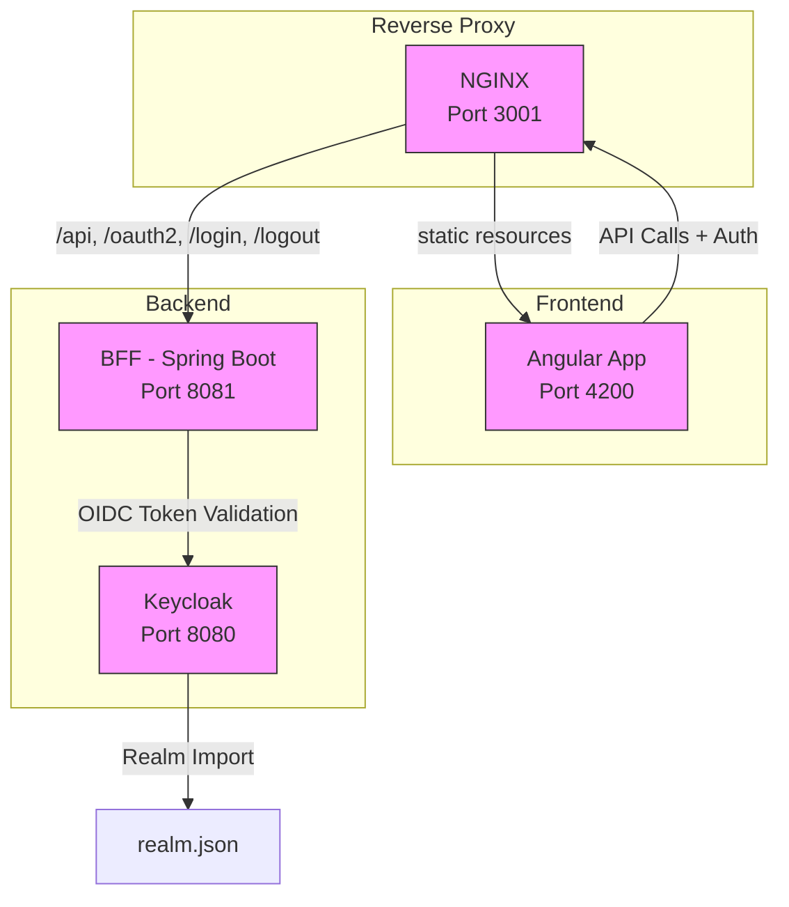

# Projet BFF Spring Boot + Angular avec OIDC et Session

## Description

Exemple d’architecture Backend For Frontend (BFF) utilisant :

- Backend Spring Boot sécurisé via OpenID Connect (Keycloak),
- Frontend Angular 18 en mode session (cookie `JSESSIONID`),
- Docker Compose pour orchestrer Keycloak, backend et frontend.



## Démarrage

```bash
docker-compose up --build
```

> Entrez dans le système par http://localhost:3001 

(user / password pour vous logger dans keycloak)

Accès direct au container (non recomandé)
- Frontend : http://localhost:4200

- Backend : http://localhost:8081

- Keycloak : http://localhost:8080

## Autologin
http://localhost:3001?clientId=toto

(retourne le paramètre clientId=toto au frontend après connexion => cliquez sur UserInfo pour voir clientId=toto dans le json de retour)

## Ajout de swagger-ui en passant par nginx
- Ajout des règles location /swagger-ui et location /v3/api-docs dans nginx.conf
- Dans Bff, 
  - Ajout dans le pom.xml

      ```
        <!-- swagger ui -->
        <dependency>
            <groupId>org.springdoc</groupId>
            <artifactId>springdoc-openapi-starter-webmvc-ui</artifactId>
            <version>2.5.0</version>
        </dependency>
      ```

  - Création de la classe OpenApiConfig
  - Ajout de la configuration dans application.yml

      ```
      # application.properties
      springdoc:
        api-docs.path: /v3/api-docs
        # Indique explicitement à Swagger-UI l'URL du JSON (optionnel si default)
        swagger-ui:
          url: /v3/api-docs
          # (optionnel) si tu veux exposer la UI sous /swagger-ui.html ou autre
          path: /swagger-ui.html    
      ```

### Différent test

- swagger : http://localhost:8081/swagger-ui/index.html en http 403 !!!!
- page 404 : http://localhost:3001/test404 (ne fonctionne seulement si le fichier `./frontend/Dockerfile-prod` est pris en compte par le docker-compose - frontend buildé)
- page 500 : http://localhost:3001/test500 (ne fonctionne seulement si le fichier `./frontend/Dockerfile-prod` est pris en compte par le docker-compose - frontend buildé)

## Fonctionnalités

Authentification via Keycloak (OIDC),

Session gérée côté backend avec cookie JSESSIONID,

Proxy Angular redirigeant les appels API vers le backend,

Appels sécurisés à une API REST protégée.

## Structure

bff/ : backend Spring Boot,

frontend/ : frontend Angular,

keycloak/ : configuration Keycloak,

docker-compose.yml : orchestration.

## Personnalisation

Modifier keycloak/realm.json pour la config OIDC,

Configurer backend dans bff/src/main/resources/application.yml,

Modifier frontend dans frontend/src/app/.

## Auteur

Thierry – Architecte transverse en informatique, passionné d’open source.


## Vrac
http://localhost:8081/api/public/hello
http://localhost:8081/api/secur/hello


http://localhost:3001/api/secur/hello
http://localhost:3001/api/public/hello
http://localhost:3001/


https://github.com/brakmic/Angular-BFF-Keycloak


http://bff-keycloak:8080/realms/myrealm/protocol/openid-connect/auth?response_type=code&client_id=bff-client&scope=openid%20profile&state=iQD8nZ-T-G9_fsosLnU85R3jHu0jCX5eMO3qfdrCFzQ%3D&redirect_uri=http://localhost:8081/login/oauth2/code/bff-client&nonce=b_qnUXpD7_GRtu0_uLojf2td6awILTC7-DO4Kq75xXo

http://bff-keycloak:8080/realms/myrealm/protocol/openid-connect/auth?response_type=code&client_id=bff-client&scope=openid%20profile&state=fp8gpOOwnh4k8NXEdZ1saOYLdr406mvipC28FMDzTg4%3D&redirect_uri=http://localhost:8081/login/oauth2/code/bff-client&nonce=BJKFODRnnAqnaYK7E_O-JmDZbz44xNBxnhELSdrlXQ8


http://bff-keycloak:8080/realms/myrealm/protocol/openid-connect/auth?response_type=code&client_id=bff-client&scope=openid%20profile&state=fp8gpOOwnh4k8NXEdZ1saOYLdr406mvipC28FMDzTg4%3D&redirect_uri=http://localhost/login/oauth2/code/bff-client&nonce=BJKFODRnnAqnaYK7E_O-JmDZbz44xNBxnhELSdrlXQ8


@RestController
public class AuthController {

    @GetMapping("/login")
    public void login(HttpServletRequest request, HttpServletResponse response) throws IOException {
        // Récupérer le paramètre clientId
        String clientId = request.getParameter("clientId");

        // Construire l'URL de redirection vers OIDC avec le paramètre clientId
        String redirectUrl = "/oauth2/authorization/bff-client";
        if (clientId != null) {
            redirectUrl += "?clientId=" + clientId;
        }

        // Rediriger vers le point d'entrée OIDC
        response.sendRedirect(redirectUrl);
    }

    @GetMapping("/login/success")
    public void loginSuccess(HttpServletRequest request, HttpServletResponse response) throws IOException {
        // Récupérer le paramètre clientId après authentification
        String clientId = request.getParameter("clientId");

        // Rediriger vers le frontend avec le paramètre clientId
        String frontendUrl = "http://localhost:3001";
        if (clientId != null) {
            frontendUrl += "?clientId=" + clientId;
        }

        response.sendRedirect(frontendUrl);
    }
}

// spring security

@Override
protected void configure(HttpSecurity http) throws Exception {
    http
        .authorizeRequests()
            .anyRequest().authenticated()
            .and()
        .oauth2Login()
            .defaultSuccessUrl("/login/success", true);
}


// 

import { Component, OnInit } from '@angular/core';
import { ActivatedRoute, Router } from '@angular/router';
import { AuthService } from './auth.service';

@Component({
  selector: 'app-root',
  templateUrl: './app.component.html',
  styleUrls: ['./app.component.css']
})
export class AppComponent implements OnInit {
  clientId: string | null = null;

  constructor(
    private route: ActivatedRoute,
    private router: Router,
    private authService: AuthService // Réintégration d'AuthService
  ) {}

  ngOnInit() {
    // Lire les paramètres de l'URL
    this.route.queryParamMap.subscribe(params => {
      this.clientId = params.get('clientId');
      console.log('Client ID:', this.clientId);

      // Si le paramètre clientId est présent, déclencher l'authentification
      if (this.clientId) {
        this.triggerLogin();
      }
    });
  }

  triggerLogin() {
    // Rediriger vers le backend pour initier l'authentification OIDC
    window.location.href = `/login?clientId=${this.clientId}`;
  }

  // Exemple d'utilisation d'AuthService
  callDirectPublicApi() {
    this.authService.callDirectPublicHello().subscribe(data => {
      console.log('Public API Response:', data);
    });
  }
}

