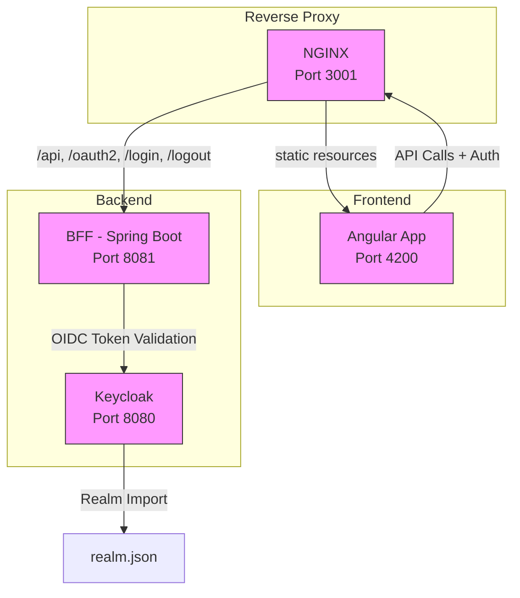

# Projet BFF Spring Boot + Angular avec OIDC et Session

## Description

Exemple d’architecture Backend For Frontend (BFF) utilisant :

- Backend Spring Boot sécurisé via OpenID Connect (Keycloak),
- Frontend Angular 18 en mode session (cookie `JSESSIONID`),
- Docker Compose pour orchestrer Keycloak, backend et frontend.



## Démarrage

```bash
docker-compose up --build
```

Entrez dans le système par http://localhost:3001 

(user / password pour vous logger dans keycloak)


Frontend : http://localhost:4200

Backend : http://localhost:8081

Keycloak : http://localhost:8080


http://localhost:8081/swagger-ui/index.html en http 403 !!!!

## Fonctionnalités

Authentification via Keycloak (OIDC),

Session gérée côté backend avec cookie JSESSIONID,

Proxy Angular redirigeant les appels API vers le backend,

Appels sécurisés à une API REST protégée.

## Structure

bff/ : backend Spring Boot,

frontend/ : frontend Angular,

keycloak/ : configuration Keycloak,

docker-compose.yml : orchestration.

## Personnalisation

Modifier keycloak/realm.json pour la config OIDC,

Configurer backend dans bff/src/main/resources/application.yml,

Modifier frontend dans frontend/src/app/.

## Auteur

Thierry – Architecte transverse en informatique, passionné d’open source.


## Vrac
http://localhost:8081/api/public/hello
http://localhost:8081/api/secur/hello


http://localhost:3001/api/secur/hello
http://localhost:3001/api/public/hello
http://localhost:3001/


https://github.com/brakmic/Angular-BFF-Keycloak


http://bff-keycloak:8080/realms/myrealm/protocol/openid-connect/auth?response_type=code&client_id=bff-client&scope=openid%20profile&state=iQD8nZ-T-G9_fsosLnU85R3jHu0jCX5eMO3qfdrCFzQ%3D&redirect_uri=http://localhost:8081/login/oauth2/code/bff-client&nonce=b_qnUXpD7_GRtu0_uLojf2td6awILTC7-DO4Kq75xXo

http://bff-keycloak:8080/realms/myrealm/protocol/openid-connect/auth?response_type=code&client_id=bff-client&scope=openid%20profile&state=fp8gpOOwnh4k8NXEdZ1saOYLdr406mvipC28FMDzTg4%3D&redirect_uri=http://localhost:8081/login/oauth2/code/bff-client&nonce=BJKFODRnnAqnaYK7E_O-JmDZbz44xNBxnhELSdrlXQ8


http://bff-keycloak:8080/realms/myrealm/protocol/openid-connect/auth?response_type=code&client_id=bff-client&scope=openid%20profile&state=fp8gpOOwnh4k8NXEdZ1saOYLdr406mvipC28FMDzTg4%3D&redirect_uri=http://localhost/login/oauth2/code/bff-client&nonce=BJKFODRnnAqnaYK7E_O-JmDZbz44xNBxnhELSdrlXQ8
