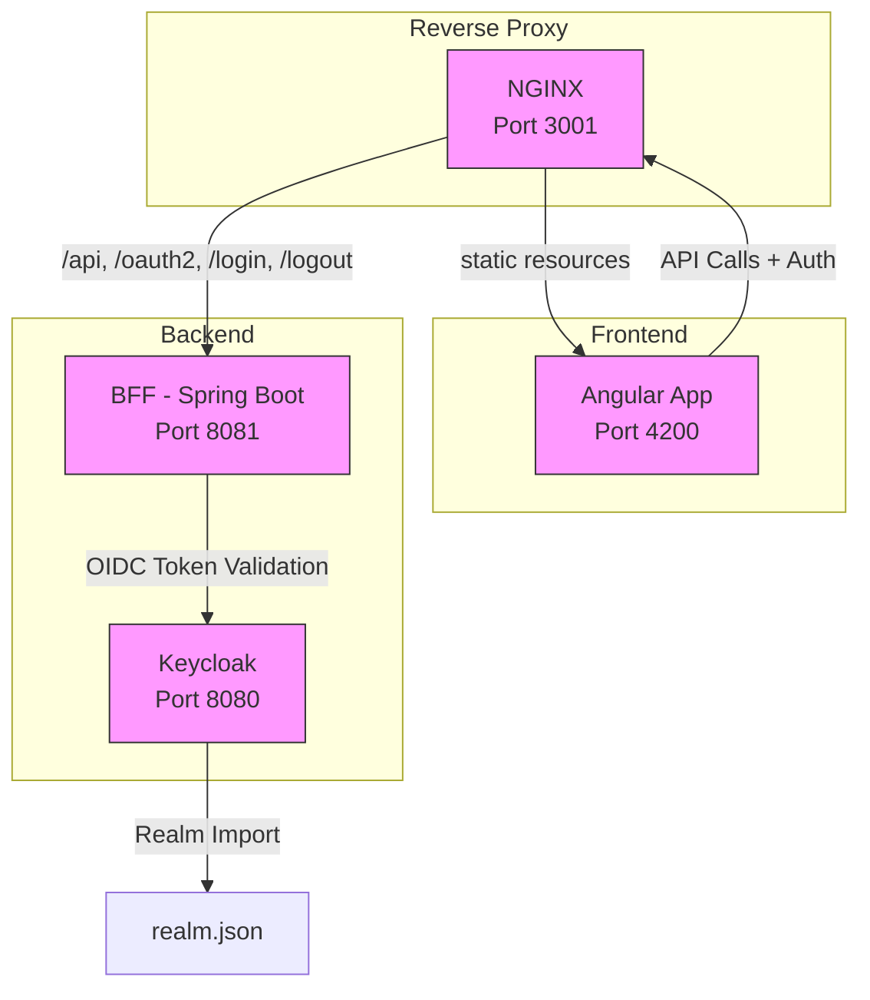

# Projet BFF Spring Boot + Angular avec OIDC et Session

## Description

Exemple d’architecture Backend For Frontend (BFF) utilisant :

- Backend Spring Boot sécurisé via OpenID Connect (Keycloak),
- Frontend Angular 18 en mode session (cookie `JSESSIONID`),
- Docker Compose pour orchestrer Keycloak, backend et frontend.


```mermaid
graph TD
  subgraph Reverse Proxy
    nginx[NGINX<br/>Port 3001]
  end

  subgraph Frontend
    angular[Angular App<br/>Port 4200]
  end

  subgraph Backend
    bff[BFF - Spring Boot<br/>Port 8081]
    keycloak[Keycloak<br/>Port 8080]
  end

  nginx -->|static resources| angular
  nginx -->|"/api, /oauth2, /login, /logout"| bff

  angular -->|API Calls + Auth| nginx

  bff -->|OIDC Token Validation| keycloak

  keycloak -->|Realm Import| realm[realm.json]

  %% Optionnel : API backend si activé un jour
  %% bff -->|Calls secured REST API| apis[APIs (commented out)]

  classDef container fill:#f9f,stroke:#333,stroke-width:1px;
  class nginx,angular,bff,keycloak container;

```

## Démarrage

```bash
docker-compose up --build
```

> Entrez dans le système par http://localhost:3001 

(user / password pour vous logger dans keycloak)

Accès direct au container (non recomandé)
- Frontend : http://localhost:4200

- Backend : http://localhost:8081

- Keycloak : http://localhost:8080

## Autologin
http://localhost:3001?clientId=toto

(retourne le paramètre clientId=toto au frontend après connexion => cliquez sur UserInfo pour voir clientId=toto dans le json de retour)

## Ajout de swagger-ui en passant par nginx
- Ajout des règles location /swagger-ui et location /v3/api-docs dans nginx.conf
- Dans Bff, 
  - Ajout dans le pom.xml

      ```
        <!-- swagger ui -->
        <dependency>
            <groupId>org.springdoc</groupId>
            <artifactId>springdoc-openapi-starter-webmvc-ui</artifactId>
            <version>2.5.0</version>
        </dependency>
      ```

  - Création de la classe OpenApiConfig
  - Ajout de la configuration dans application.yml

      ```
      # application.properties
      springdoc:
        api-docs.path: /v3/api-docs
        # Indique explicitement à Swagger-UI l'URL du JSON (optionnel si default)
        swagger-ui:
          url: /v3/api-docs
          # (optionnel) si tu veux exposer la UI sous /swagger-ui.html ou autre
          path: /swagger-ui.html    
      ```

### Différent test

- swagger : http://localhost:8081/swagger-ui/index.html en http 403 !!!!
- page 404 : http://localhost:3001/test404 (ne fonctionne seulement si le fichier `./frontend/Dockerfile-prod` est pris en compte par le docker-compose - frontend buildé)
- page 500 : http://localhost:3001/test500 (ne fonctionne seulement si le fichier `./frontend/Dockerfile-prod` est pris en compte par le docker-compose - frontend buildé)

## Fonctionnalités

Authentification via Keycloak (OIDC),

Session gérée côté backend avec cookie JSESSIONID,

Proxy Angular redirigeant les appels API vers le backend,

Appels sécurisés à une API REST protégée.

## Structure

bff/ : backend Spring Boot,

frontend/ : frontend Angular,

keycloak/ : configuration Keycloak,

docker-compose.yml : orchestration.

## Personnalisation

Modifier keycloak/realm.json pour la config OIDC,

Configurer backend dans bff/src/main/resources/application.yml,

Modifier frontend dans frontend/src/app/.

## Auteur

Thierry – Architecte transverse en informatique, passionné d’open source.

## Fake oidc

http://localhost:8090/userinfo
http://localhost:8090/.well-known/openid-configuration
